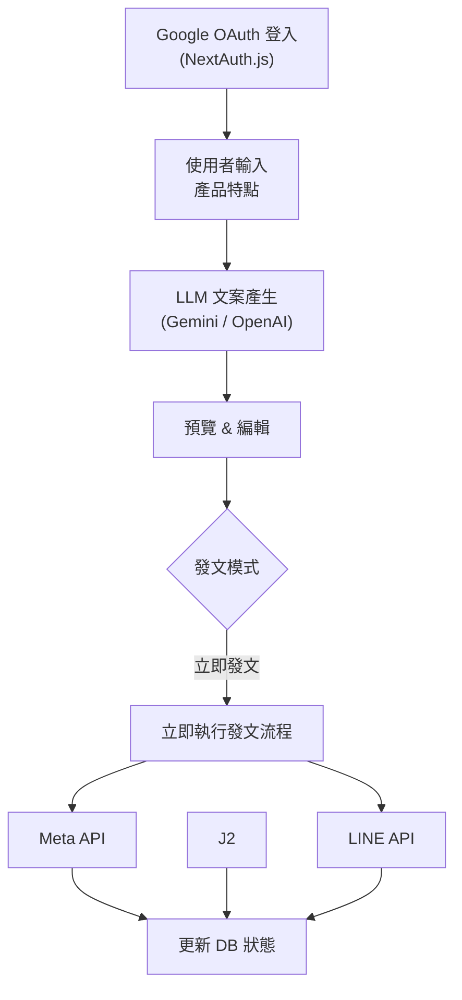

# AI 社群發文系統 (AI Social Publisher) — 最終實作計畫

> GitHub Repo: `newesp/ai-social-publisher`

## 目標

建置一個 Web-based 自動化流程：登入後輸入產品核心特點 → AI 產生各平台專屬文宣 → 預覽並編輯 → 立即發文到 Meta / LINE。所有操作記錄均存入資料庫。

MVP 暫緩 Instagram、Imgur 圖片上傳與排程功能；等有 Instagram 粉專與圖片發布需求後再進入下一階段。

## 系統架構



## 技術選型

| 項目 | 技術 | 說明 |
|---|---|---|
| 前端框架 | **Next.js (App Router)** | SSR + API Routes |
| UI 元件庫 | **Mantine** | 淺色主題 (Light)，主色橘色 (Orange) |
| 認證 | **NextAuth.js (Auth.js) + Google OAuth** | 限定特定 Google 帳號 |
| LLM 文案 | Google Gemini / OpenAI GPT | 可切換 Provider |
| 圖片生成 | Google Gemini Image / OpenAI GPT Image | 下一階段；Google 預設 `gemini-3.1-flash-image`，OpenAI 預設 `gpt-image-2` |
| 圖片託管 | **Imgur API** | 下一階段；目前不接 Imgur |
| 資料庫 | **Turso (Serverless SQLite)** | `libsql://auto-posting-newesp.aws-ap-northeast-1.turso.io` |
| 排程 | **Vercel Cron Jobs** | 定期觸發 `/api/cron` |
| 部署 | **Vercel** | Serverless |

---

## Proposed Changes

### 1. 專案初始化與依賴

#### [NEW] Next.js 專案
```bash
npx create-next-app@latest ./
```

#### 安裝依賴
```bash
# UI
npm install @mantine/core @mantine/hooks @mantine/dates @mantine/notifications @tabler/icons-react dayjs

# Auth
npm install next-auth

# AI
npm install @google/genai openai

# Database
npm install @libsql/client drizzle-orm
npm install -D drizzle-kit

# Platform APIs & Utilities
npm install axios form-data
```

#### [NEW] .env.local
```env
# Auth (Google OAuth)
NEXTAUTH_URL=http://localhost:3000
NEXTAUTH_SECRET=your_random_secret
GOOGLE_CLIENT_ID=your_google_client_id
GOOGLE_CLIENT_SECRET=your_google_client_secret
ADMIN_EMAILS=admin@gmail.com,another@gmail.com

# AI Providers
GOOGLE_AI_API_KEY=
OPENAI_API_KEY=

# Turso DB
TURSO_DATABASE_URL=libsql://auto-posting-newesp.aws-ap-northeast-1.turso.io
TURSO_AUTH_TOKEN=your_turso_auth_token

# Imgur (Phase 2)
IMGUR_CLIENT_ID=

# Meta
META_PAGE_ID=
META_PAGE_ACCESS_TOKEN=

# Instagram (Phase 2)
INSTAGRAM_USER_ID=

# LINE
LINE_CHANNEL_ACCESS_TOKEN=
```

---

### 2. 認證層 (NextAuth.js + Google OAuth)

#### [NEW] src/lib/auth.js
- NextAuth 設定：Google Provider
- MVP 展示期允許所有 Google 帳號登入
- 以 `ADMIN_EMAILS` 判斷 admin 權限；API key 設定、匯入、匯出、平台 token 修改只允許 admin
- 一般使用者可登入展示流程，但不允許修改正式平台憑證

#### [NEW] src/app/api/auth/[...nextauth]/route.js
- NextAuth API handler

#### [NEW] src/middleware.js
- Next.js Middleware：保護所有 `/` 和 `/api/` 路由
- 未登入使用者一律導向登入頁面
- `/api/auth/*` 和 `/api/cron` (加上 secret 驗證) 排除在外
- admin-only API route 需在 handler 內再次檢查 role，不能只靠前端隱藏按鈕

#### [NEW] src/app/login/page.js
- 登入頁面：Logo、標題、「使用 Google 帳號登入」按鈕
- 橘色漸層背景，Mantine Card 風格

---

### 3. 資料庫層 (Turso + Drizzle ORM)

#### [NEW] src/lib/db/index.js
- Turso client 初始化 (`@libsql/client`)
- Drizzle ORM 連接設定

#### [NEW] src/lib/db/schema.js
```
posts 表:
  id (INTEGER PK)
  product_name (TEXT)
  product_features (TEXT)
  platform (TEXT: meta|instagram|line)
  content (TEXT - 生成的文案)
  hashtags (TEXT)
  image_prompt (TEXT)
  image_local_path (TEXT)
  image_imgur_url (TEXT)
  status (TEXT: draft|scheduled|publishing|published|failed)
  error_message (TEXT)
  scheduled_for (DATETIME, nullable)
  published_at (DATETIME, nullable)
  created_at (DATETIME)
  updated_at (DATETIME)

settings 表:
  key (TEXT PK)
  value (TEXT - 加密儲存)
  updated_at (DATETIME)

audit_logs 表:
  id (INTEGER PK)
  actor_email (TEXT)
  action (TEXT: settings_update|secrets_export|secrets_import|publish)
  target_type (TEXT)
  target_id (TEXT, nullable)
  metadata_json (TEXT - 不包含任何 secret 原文)
  created_at (DATETIME)
```

#### [NEW] drizzle.config.js
- Drizzle Kit 設定，指向 Turso DB

---

### 4. AI 服務層

#### [NEW] src/lib/ai/llm-provider.js
- `GeminiProvider`: Google Gemini API interactions endpoint → `gemini-3.5-flash`
- `OpenAIProvider`: `openai` SDK → `gpt-4o`
- 工廠函式 `createLLMProvider(type)` 根據設定建立對應 Provider
- 統一介面：`generateContent(systemPrompt, userPrompt) → string`

#### [NEW] src/lib/ai/image-provider.js
- `GeminiImageProvider`: Google Gemini API interactions endpoint → `gemini-3.1-flash-image` (Phase 2)
- `OpenAIImageProvider`: `openai` SDK → `gpt-image-2`
- `dall-e-3` 僅作 legacy fallback，不作主要選項
- 工廠函式 `createImageProvider(type)`
- 統一介面：`generateImage(prompt, aspectRatio) → Buffer (image bytes)`

#### [NEW] src/lib/ai/prompts.js
- 各平台專屬 prompt 模板 (Meta: 長文+CTA / IG: emoji+hashtag / LINE: 簡短親切)
- 圖片生成 prompt 轉換器

---

### 5. 平台發文服務

#### [NEW] src/lib/platforms/meta.js
- `postToFacebook(message, imageUrl)` → Graph API v25.0

#### [PHASE 2] src/lib/platforms/instagram.js
- `postToInstagram(caption, imageUrl)` → 兩步驟 (container → publish)

#### [NEW] src/lib/platforms/line.js
- `broadcastToLine(text, imageUrl)` → LINE Messaging API broadcast

#### [NEW] src/lib/platforms/imgur.js
- Phase 2：`uploadToImgur(imageBuffer) → string (公開 URL)`

---

### 6. API Routes

| Route | Method | 功能 |
|---|---|---|
| `/api/auth/[...nextauth]` | * | NextAuth 認證端點 |
| `/api/generate` | POST | AI 生成 Meta / LINE 文案 |
| `/api/posts` | GET | 取得發文歷史與排程清單 |
| `/api/posts` | POST | 建立貼文（立即發文或排程） |
| `/api/posts/[id]` | DELETE | 取消排程 |
| `/api/posts/[id]/publish` | POST | 手動觸發發文 |
| `/api/upload` | POST | Phase 2：上傳圖片至 Imgur |
| `/api/settings` | GET/PUT | 取得/更新 API Keys 設定 |
| `/api/cron` | GET | Phase 2：Vercel Cron 定期觸發排程發文 |

---

### 7. 前端 UI 頁面

#### Layout 結構
```
┌──────────────────────────────────────────┐
│  Header: Logo + 使用者頭像 + 登出        │
├──────────┬───────────────────────────────┤
│          │                               │
│  Sidebar │     Main Content              │
│          │                               │
│  📝 新增  │    (根據選單切換)              │
│  📋 歷史  │                               │
│  ⚙️ 設定  │                               │
│          │                               │
└──────────┴───────────────────────────────┘
```

#### [NEW] 新增貼文 — 步驟精靈 (Mantine Stepper)

**Step 1: 產品資訊輸入**
- 產品名稱 (TextInput)
- 核心特點 (Textarea，支援多行)
- 目標受眾 (Select: 年輕族群/專業人士/家庭主婦/銀髮族/通用)
- 語氣風格 (Select: 專業/活潑/親切/高級感/幽默)
- 發文平台 (Checkbox Group: Meta ☑ / LINE ☑；Instagram Phase 2 隱藏)

**Step 2: AI Provider 選擇**
- LLM Provider (SegmentedControl: Gemini / OpenAI)
- Image Provider (SegmentedControl: Google Gemini Image / OpenAI GPT Image)
- Google 圖片預設模型：`gemini-3.1-flash-image`
- OpenAI 圖片預設模型：`gpt-image-2`
- 避免在 MVP 預設使用即將停用或 legacy 圖片模型

**Step 3: 預覽與編輯**
- 各平台以獨立 Card 顯示生成的文案 (可編輯 Textarea)
- AI 生成文案預覽 (可點擊「重新生成」)
- Hashtag 區塊 (可新增/移除標籤)
- 硬規定：預覽必須符合各平台實際所見，不可只用 generic preview
- Meta / Instagram / LINE 預覽需各自呈現實際圖片位置、文字換行、caption/hashtag 呈現、截斷規則與平台視覺比例
- 「確認發文」前必須顯示各平台最終預覽；使用者看到的內容需與即將送出的 payload 一致

**Step 4: 發文設定與確認**
- MVP 僅支援立即發文；預約排程為 Phase 2
- 平台發文最終確認 Checklist
- 「確認發文」按鈕 + 發文進度 (Progress bar + 各平台狀態 Badge)

#### [NEW] 發文歷史與排程管理

- **Mantine DataTable** 顯示所有貼文
- 欄位：產品名稱、平台、狀態 (Badge)、排程時間、發布時間、操作
- 篩選器：依平台、依狀態
- 操作：「立即發文」(對 pending 排程)、「取消排程」、「查看詳情」

#### [NEW] 系統設定 (Settings)

- **Mantine Tabs** 分頁：
  - **AI 模型**：API Key 輸入 (PasswordInput)、預設 Provider 選擇
  - **社群平台**：Meta/LINE Token 設定、「測試連線」按鈕；IG 為 Phase 2
  - **整合服務**：Imgur Client ID (Phase 2)
- 設定頁屬於 admin-only 功能；一般登入使用者不可查看或修改 API key/token
- API key 顯示一律 mask，不回傳完整原文

#### [PHASE 2] API Key 匯出 / 匯入

- 目的：支援多人管理，以及將憑證交給另一個部署環境或另一位管理員匯入使用
- 匯出格式：加密 JSON，例如 `ai-social-publisher-secrets-YYYY-MM-DD.json`
- 匯出內容：AI provider key、Meta/Instagram/LINE token、Imgur Client ID、schema version、匯出時間
- 加密方式：由 admin 匯出時輸入 passphrase；匯出包不依賴原部署環境的 `SETTINGS_ENCRYPTION_KEY`
- 匯入流程：上傳匯出包、輸入 passphrase、先 preview 將匯入的 key 類型與衝突狀態，再選擇「只新增缺少的 key」或「覆蓋既有 key」
- 權限：僅 admin 可匯入/匯出
- 稽核：記錄誰匯出、誰匯入、匯入/匯出的 key 類型與時間；audit log 不可保存任何 secret 原文

---

### 8. 部署設定

#### [NEW] vercel.json
```json
{
  "crons": [
    {
      "path": "/api/cron",
      "schedule": "*/5 * * * *"
    }
  ]
}
```
> 每 5 分鐘檢查一次待發佈的排程貼文 (需 Vercel Pro)

---

## 專案目錄結構

```
ai-social-publisher/
├── .env.local
├── vercel.json
├── drizzle.config.js
├── next.config.js
├── package.json
├── src/
│   ├── middleware.js                  # Auth 保護
│   ├── app/
│   │   ├── layout.js                 # Root Layout (MantineProvider)
│   │   ├── globals.css               # 全域樣式
│   │   ├── page.js                   # 首頁 (新增貼文精靈)
│   │   ├── login/
│   │   │   └── page.js               # 登入頁面
│   │   ├── history/
│   │   │   └── page.js               # 發文歷史與排程
│   │   ├── settings/
│   │   │   └── page.js               # 系統設定
│   │   └── api/
│   │       ├── auth/[...nextauth]/route.js
│   │       ├── generate/route.js
│   │       ├── posts/route.js
│   │       ├── posts/[id]/route.js
│   │       ├── posts/[id]/publish/route.js
│   │       ├── upload/route.js
│   │       ├── settings/route.js
│   │       ├── settings/export/route.js  # Phase 2
│   │       ├── settings/import/route.js  # Phase 2
│   │       └── cron/route.js
│   ├── components/
│   │   ├── AppShell.js               # Layout 殼 (Sidebar + Header)
│   │   ├── CreatePostWizard.js       # 步驟精靈
│   │   ├── ProductInput.js
│   │   ├── ProviderSelector.js
│   │   ├── ContentPreview.js
│   │   ├── PublishConfirm.js
│   │   ├── PostHistory.js
│   │   └── SettingsPanel.js
│   └── lib/
│       ├── auth.js                   # NextAuth 設定
│       ├── db/
│       │   ├── index.js              # Turso 連線
│       │   └── schema.js             # Drizzle Schema
│       ├── ai/
│       │   ├── llm-provider.js
│       │   ├── image-provider.js
│       │   └── prompts.js
│       └── platforms/
│           ├── meta.js
│           ├── instagram.js
│           ├── line.js
│           └── imgur.js
```

---

## Verification Plan

### Automated Tests
```bash
npm run build                 # 確認編譯成功
npx drizzle-kit push          # 推送 schema 到 Turso DB
```

### Manual Verification
1. **認證測試**：確認非白名單的 Google 帳號無法登入
2. **設定測試**：在設定頁面填入 API Keys，驗證 Test Connection 功能
3. **AI 生成測試**：完整走過步驟精靈
4. **立即發文測試**：選擇立即發文，確認各平台成功發文
5. **排程發文測試**：設定排程，手動呼叫 `/api/cron`，確認自動發文
6. **Imgur 上傳測試**：驗證圖片成功上傳並取得公開 URL
